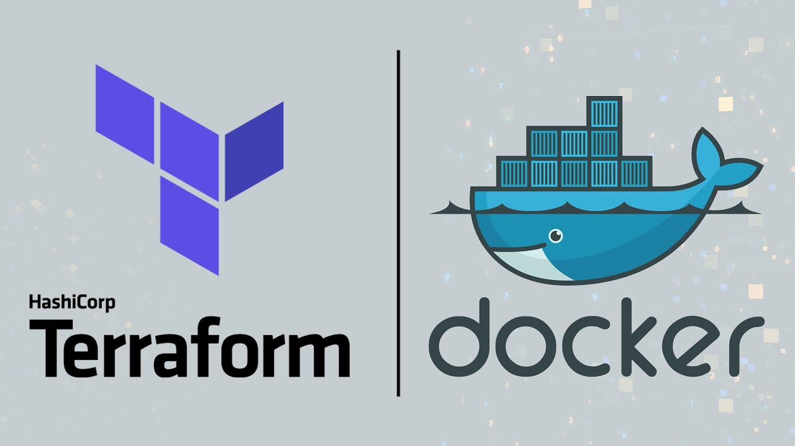

# Module I: Containerization and Infrastructure as Code

This module focuses on essential concepts in containerization and Infrastructure as Code (IaC). By the end of this
module, you will gain hands-on experience with Docker, docker-compose, and Terraform, enabling you to efficiently manage
and scale your infrastructure.

Topics:

- Course introduction
- Introduction to GCP
- Docker and docker-compose
- Running Postgres locally with Docker
- Setting up infrastructure on GCP with Terraform

