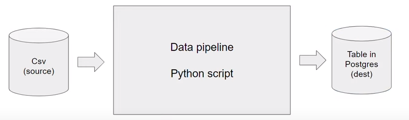

<br />
<div align="center">
  <a href="#">
    
  </a>

<h1 align = "center">
<b><i>Introduction to Docker</i></b>
</h1>

  <p align="center">
  </p>
</div>
<br />

Docker is a platform that uses OS-level virtualization in order to deliver software packages
in containers.
Containers are lightweight, portable and isolated environments that package an application
and its dependencies, ensuring consistent performance across different environments.

**Why should data engineers care about Docker?**

- Setting up things locally for experiments
- Integration tests, CI/CD
- Batch jobs (AWS Batch, Kubernetes jobs, etc — outside of the scope)
- Spark
- Serverless (AWS Lambda)
- So containers are everywhere

**Data Pipelines : (Sources) => Scripts => (Result Set)**


When running a data pipeline inside a container, it is ensured that dependencies
and configurations are encapsulated, promoting portability across various
environments, as the host is isolated from the container.

## Running Docker

Once we have installed docker we can test if docker is installed properly by running the command in the
terminal: `docker run hello-world`

This will do the following:

1. Go to `Docker Hub`, which contains all the Docker Images
2. Look for the image, called `hello-world`
3. Download the required packages


## Dockerfile

A Dockerfile is a script that contains instructions for building a Docker container image.
It defines the base image, sets up the environment, installs dependencies, and configures
the application.

```dockerfile
FROM python:3.9

RUN pip install pandas

ENTRYPOINT ["bash"]
```

* `FROM`: Specifies the base image for the Docker container
* `RUN`: Executes a command during the image build process.
* `ENTRYPOINT`: Sets the default command to be executed when the container starts.

To create a container from the provided Dockerfile, follow these steps:

1. Create the Dockerfile
  * Copy the Dockerfile content into a file named `Dockerfile`
2. Build the Docker image
  * Open a terminal and navigate to the directory containing your Dockerfile and run:
    ```bash
    docker build -t my-python-container .
    ```
3. Run the Docker image
  * Once the image is built, you can create and run a container with the following command:
    ```bash
    docker run -it my-python-container
    ```

## Other Docker Concepts
- **Networking**: Docker facilitates communication between containers and the host system, crucial for distributed systems and microservices architecture.
- **Volumes**: Docker volumes enable data persistence beyond the container lifecycle, vital for databases and file storage.
- **Docker Compose**: For multi-container applications, Docker Compose simplifies configuration and orchestration.
