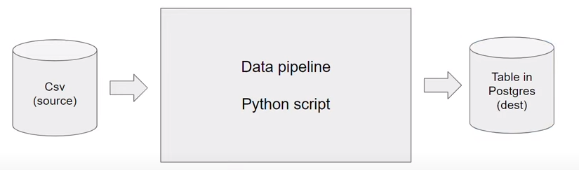
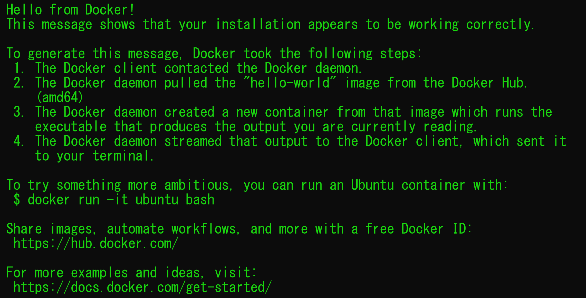

<br />
<div align="center">
  <a href="#">
    
  </a>

<h1 align = "center">
<b><i>Introduction to Docker</i></b>
</h1>

  <p align="center">
  </p>
</div>
<br />

Docker is a platform that uses OS-level virtualization in order to deliver software packages
in containers.
Containers are lightweight, portable and isolated environments that package an application
and its dependencies, ensuring consistent performance across different environments.

**Why should data engineers care about Docker?**

- Setting up things locally for experiments
- Integration tests, CI/CD
- Batch jobs (AWS Batch, Kubernetes jobs, etc — outside of the scope)
- Spark
- Serverless (AWS Lambda)
- So containers are everywhere

**Data Pipelines : (Sources) => Scripts => (Result Set)**


When running a data pipeline inside a container, it is ensured that dependencies
and configurations are encapsulated, promoting portability across various
environments, as the host is isolated from the container.

## Running Docker

Once we have installed docker we can test if docker is installed properly by running the command in the
terminal: `docker run hello-world`

This will do the following:

1. Go to `Docker Hub`, which contains all the Docker Images
2. Look for the image, called `hello-world`
3. Download the required packages



## Dockerfile

A Dockerfile is a script that contains instructions for building a Docker container image.
It defines the base image, sets up the environment, installs dependencies, and configures
the application.

```dockerfile
FROM python:3.9

RUN pip install pandas

ENTRYPOINT ["bash"]
```

* `FROM`: Specifies the base image for the Docker container
* `RUN`: Executes a command during the image build process.
* `ENTRYPOINT`: Sets the default command to be executed when the container starts.

To create a container from the provided Dockerfile, follow these steps:

1. Create the Dockerfile

* Copy the Dockerfile content into a file named `Dockerfile`

2. Build the Docker image

* Open a terminal and navigate to the directory containing your Dockerfile and run:
  ```bash
  docker build -t my-python-container .
  ```

3. Run the Docker image

* Once the image is built, you can create and run a container with the following command:
  ```bash
  docker run -it my-python-container
  ```

## Other Docker Concepts

- **Networking**: Docker facilitates communication between containers and the host system, crucial for distributed
  systems and microservices architecture.
- **Volumes**: Docker volumes enable data persistence beyond the container lifecycle, vital for databases and file
  storage.
- **Docker Compose**: For multi-container applications, Docker Compose simplifies configuration and orchestration.


<br />
<div align="center">
  <a href="#">
    
  </a>

<h1 align = "center">
<b><i>PostgreSQL</i></b>
</h1>

  <p align="center">
  </p>
</div>
<br />

## What is PostgreSQL?

PostgreSQL, often referred to as Postgres, is a robust open-source RDBMS known for its extensibility, ACID compliance,
and support for complex queries.

## Key Features

- Advanced SQL Support: PostgreSQL supports a wide range of SQL features, including complex queries, indexing, and
  transaction management.
- Extensibility: Users can define custom data types, operators, and functions, making it highly extensible.
- Concurrency Control: Offers Multi-Version Concurrency Control (MVCC) for efficient handling of concurrent
  transactions.
- Scalability: Scales well with large datasets and supports both horizontal and vertical scaling.

## Why Choose PostgreSQL?

### Open Source

Being open-source, PostgreSQL is freely available and supported by a vibrant community, encouraging collaboration and
continuous improvement.

### Extensibility and Customization

Developers can extend PostgreSQL functionalities with custom plugins, data types, and procedural languages.

### Community Support

A large and active community ensures ongoing development, support, and a wealth of resources for troubleshooting and
optimization.

## Setting up PostgreSQL

## Installation

PostgreSQL can be installed on various operating systems. Use package managers like `apt` or `yum` on Linux or download
the installer for Windows and macOS.

## Connecting to PostgreSQL

After installation, connect to the PostgreSQL server using tools like `psql` or graphical interfaces like pgAdmin.

## Setting up Postgres with Docker

To run Postgres we need to use the official Docker image of Postgres.

```yaml
services:
  postgres:
    image: postgres:13
    environment:
      POSTGRES_USER: airflow
      POSTGRES_PASSWORD: airflow
      POSTGRES_DB: airflow
    volumes:
      - postgres-db-volume:/var/lib/postgresql/data
    healthcheck:
      test: [ "CMD", "pg_isready", "-U", "airflow" ]
      interval: 5s
      retries: 5
```

- `image: postgres:13` is the image name:version
- `environment:` environment variables (user, password, database name)
- `volumes` maps a host directory to a container directory. This allows docker to persist state (mounting).

## Running Postgres with Docker

Execute the following command in order to run postgres using docker

```bash
docker run -it \
  -e POSTGRES_USER="root" \
  -e POSTGRES_PASSWORD="root" \
  -e POSTGRES_DB="ny_taxi" \
  -v "./ny-taxi-volume:/var/lib/postgresql/data" \
  -p 5432:5432 \
  postgres:13
```

* `-e POSTGRES_USER="root"`: Sets the Postgres username to "root".
* `-e POSTGRES_PASSWORD="root"`: Sets the password for the Postgres user to "root".
* `-e POSTGRES_DB="ny_taxi"`: Creates a database named "ny_taxi".
* `-v "./ny-taxi-volume:/var/lib/postgresql/data"`: Mounts a volume named "ny-taxi-volume" to persist data in the
  container.
* `-p 5432:5432`: Maps port 5432 on your local machine to port 5432 in the container.
* `postgres:13`: Specifies the Postgres Docker image version 13.


<br />
<div align="center">
  <a href="#">
    
  </a>

<h1 align = "center">
<b><i>Data Ingesting</i></b>
</h1>

  <p align="center">
  </p>
</div>
<br />

Data ingestion is a fundamental process in the field of data engineering, playing a crucial role in collecting and
importing data from various sources into a storage or processing system.
This initial step is essential for enabling organizations to harness the power of their data for analysis, reporting,
and decision-making.

## Key Components

1. **Data Sources:**

- Data can originate from diverse sources such as databases, log files, APIs, streaming platforms, and more.
  Understanding the nature and structure of these sources is crucial for effective data ingestion.

2. **Data Formats:**

- Data may exist in various formats, including structured (e.g., relational databases), semi-structured (e.g., JSON,
  XML), and unstructured (e.g., text, images). Data engineers must account for these formats during the ingestion
  process.

3. **Data Integration Tools:**

- Various tools and frameworks are available for data ingestion, such as Apache Kafka, Apache NiFi, and AWS Glue.
  These tools automate and streamline the movement of data, providing scalability, reliability, and monitoring
  capabilities.

4. **Data Transformation:**

- In some cases, data needs to be transformed during the ingestion process to ensure compatibility with the
  destination system. This may involve cleaning, enriching, or aggregating the data.

5. **Data Loading:**

- Once the data is prepared, it is loaded into the target storage or processing system. This could be a data
  warehouse, a data lake, or a real-time analytics platform.

## Running Python Scripts

We can run the [`ingest_data.py`](../01-docker-terraform/ingest_data.py) in order to load the _yellow_taxi_trip_
data to our postgres database engine.

```bash
URL="<https://github.com/DataTalksClub/nyc-tlc-data/releases/download/yellow/yellow_tripdata_2021-01.csv.gz>"

python ingest_data.py \
  --user=root \
  --password=root \
  --host=localhost \
  --port=5432 \
  --db=ny_taxi \
  --table_name=yellow_taxi_trips \
  --url="${URL}"
```

**NOTE:**

- This is not a dangerous way to pass the `password` parameter, as it is hardcoded into the command.
- It is required for us to have `wget` installed in the host machine (particularly on Windows)

Now, when refreshing the database, we can check for the total record count to see if whether the script was successful
or not.
