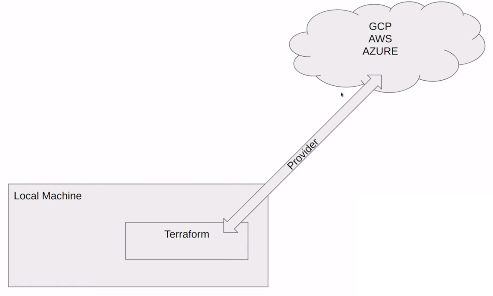

<br />
<div align="center">
  <a href="#">
    
  </a>

<h1 align = "center">
<b><i>Docker Compose</i></b>
</h1>

  <p align="center">
  </p>
</div>
<br />

Docker Compose is a tool for defining and running multi-container Docker applications.

It allows you to define all the services, networks, and volumes required for your application in a single YAML file,
making it easy to manage and deploy complex applications with multiple components.

## Getting Started

To get started with Docker Compose, you need to follow these steps:

1. **Install Docker Compose:**
   Make sure you have Docker Compose installed on your machine. The easiest and recommended way to get Docker Compose
   is to install Docker Desktop. Docker Desktop includes Docker Compose along with Docker Engine and Docker CLI which
   are Compose prerequisites.
   You can download it from the [official Docker Compose website](https://docs.docker.com/compose/install/).


2. **Create a `docker-compose.yml` file:**
   Create a YAML file named `docker-compose.yml` in the root of your project. This file will contain the configuration
   for your application services.

3. **Define Services:**
   In the `docker-compose.yml` file, define the services that make up your application, specifying the container image,
   ports, volumes, and other configurations.

  ```yaml
  services:
    pgdatabase:
      image: postgres:13
      environment:
        - POSTGRES_USER=root
        - POSTGRES_PASSWORD=root
        - POSTGRES_DB=ny_taxi
      volumes:
        - "./ny_taxi_postgres_data:/var/lib/postgresql/data:rw"
      ports:
        - "5432:5432"
    pgadmin:
      image: dpage/pgadmin4
      environment:
        - PGADMIN_DEFAULT_EMAIL=admin@admin.com
        - PGADMIN_DEFAULT_PASSWORD=root
      ports:
        - "8080:80"
  ```

## Running Docker Compose

After creating your `docker-compose.yml` file, you can use the `docker-compose up` command to start the services. By
default, this command runs in the foreground, and you can see the logs of each service in your terminal.

However, if you want to run Docker Compose in the background and detach from the terminal, you can use the `-d`
or `--detach` flag:

```bash
docker-compose up -d
```

This command starts the defined services as background processes, allowing you to continue using the terminal
for other tasks.

## Stopping Docker Compose

To stop the Docker Compose services and containers, you can use the `docker-compose down` command:
This command stops and removes the containers, networks, and volumes defined in your docker-compose.yml file.

If you started Docker Compose in detached mode (-d), you can also stop the services using:

```bash
docker-compose stop
```

This will stop the running containers without removing them. To remove the stopped containers, use:

```bash
docker-compose rm
```

To stop and remove containers in one step, you can combine the stop and rm commands:

```bash
docker-compose down --volumes
```

The --volumes flag ensures that associated volumes are also removed.

Remember that when making changes to your docker-compose.yml file, it's a good practice to run
`docker-compose up --build` to rebuild the containers with the updated configurations.

These commands provide the flexibility to manage the lifecycle of your Docker Compose applications,
making it easy to start, stop, and clean up resources as needed.


<br />
<div align="center">
  <a href="#">
    
  </a>

<h1 align = "center">
<b><i>Terraform</i></b>
</h1>

  <p align="center">
  </p>
</div>
<br />

Terraform is an open-source Infrastructure as Code (IaC) tool developed by HashiCorp.
It enables users to define and provision infrastructure using a declarative configuration language.

With Terraform, you can manage and automate the deployment of infrastructure across various cloud providers and
on-premises environments.

## Advantages

- Simplicity in keeping track of infrastructure
- Reproducibility
- Easier collaboration
- Ensure resources are removed

## What Terraform is not

- Does not manage and update code on infrastructure
- Does not give you the ability to change immutable resources
- Not used to manage resources not defined in your terraform files

## How does it work?



We need to have Terraform downloaded and running on our local machine. A provider allows us to communicate with
different services that allow us to bring up infrastructure. We will need to authorize the access (via service account,
access token, etc.)

## Key Commands

- `terraform init` - Once we have defined the provider when we run this command it is going to go out and get that code
  and bring it to our local machine
- `terraform apply` - We can run this command to build the infrastructure based on what is defined in the `.tf` files
- `terraform plan` - Once we have defined some resources we can run this command to see the resources that will be
  created
- `terraform destroy` - we can run this command to remove everything defined in the `.tf` files
