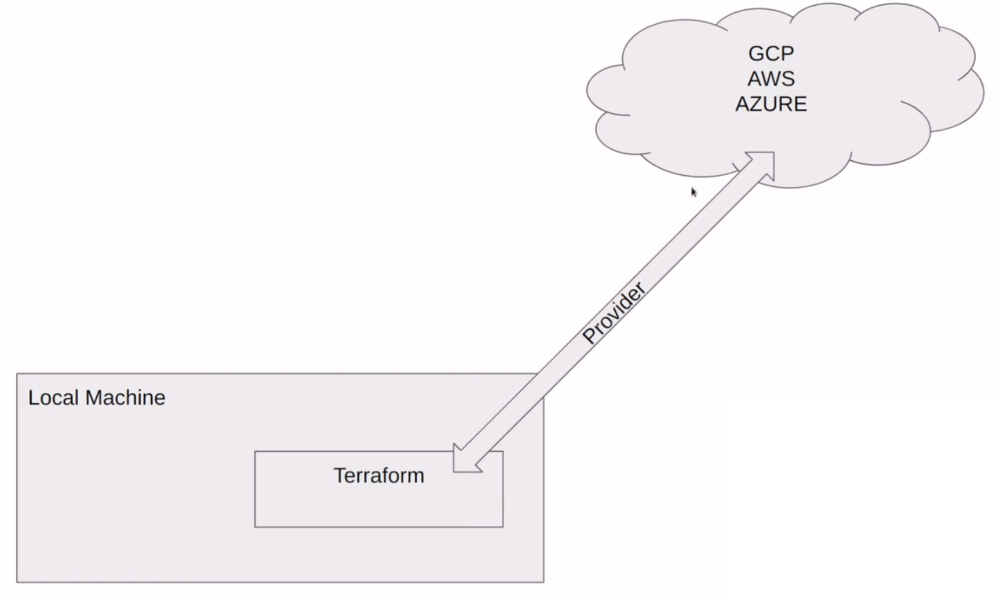

 

  

<h1 align = "center">
<b><i>Terraform</i></b>
</h1>

  

  

 

Terraform is an open-source Infrastructure as Code (IaC) tool developed by HashiCorp.
It enables users to define and provision infrastructure using a declarative configuration language.

With Terraform, you can manage and automate the deployment of infrastructure across various cloud providers and
on-premises environments.

## Advantages

- Simplicity in keeping track of infrastructure
- Reproducibility
- Easier collaboration
- Ensure resources are removed

## What Terraform is not

- Does not manage and update code on infrastructure
- Does not give you the ability to change immutable resources
- Not used to manage resources not defined in your terraform files

## How does it work?

We need to have Terraform downloaded and running on our local machine. A provider allows us to communicate with
different services that allow us to bring up infrastructure. We will need to authorize the access (via service account,
access token, etc.)

## Key Commands

- `terraform init` - Once we have defined the provider when we run this command it is going to go out and get that code
  and bring it to our local machine
- `terraform apply` - We can run this command to build the infrastructure based on what is defined in the `.tf` files
- `terraform plan` - Once we have defined some resources we can run this command to see the resources that will be
  created
- `terraform destroy` - we can run this command to remove everything defined in the `.tf` files
