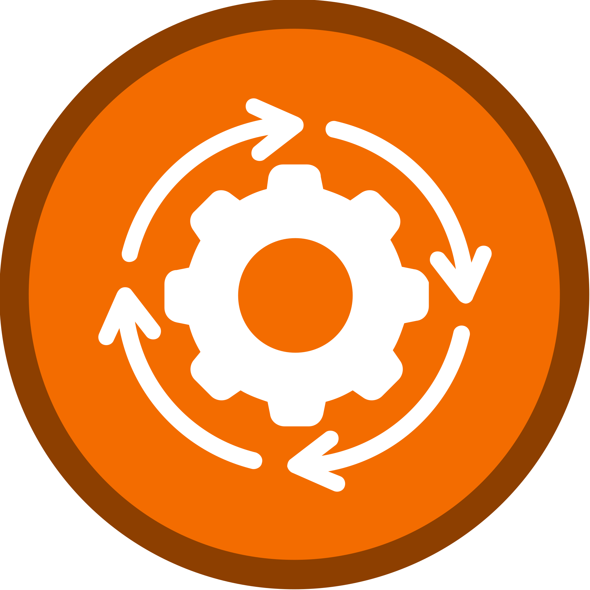
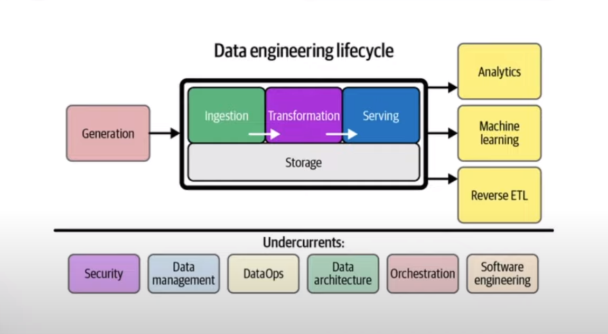

 

  

<h1 align = "center">
<b><i>Orchestration</i></b>
</h1>

  

  

 

In the realm of data engineering, orchestrating complex workflows is essential for managing data pipelines efficiently.
Orchestration tools play a pivotal role in coordinating and automating the execution of tasks within these workflows.
Some popular tools in this domain are Apache Airflow, Luigi, Argo, Prefect & Mage.

## Data Engineering Lifecycle

A large part of data engineering is extracting, transforming, and loading data between sources.

Orchestration is a process of dependency management, facilitated through automation.

The data orchestrator manages scheduling, triggering, monitoring and even resource allocation.

Every workflow requires sequential steps.

**Steps = tasks**

**Workflows = DAGs/ pipeline**

Orchestration is an undercurrent because it happens throughout the entire process while being a key component of it.

## Qualities

A good orchestrator handles:

- Workflow management
- Automation
- Error handling
- Recovery
- Monitoring and alerting
- Resource optimization
- Observability
- Debugging
- Compliance and auditing
- Developer Experience
