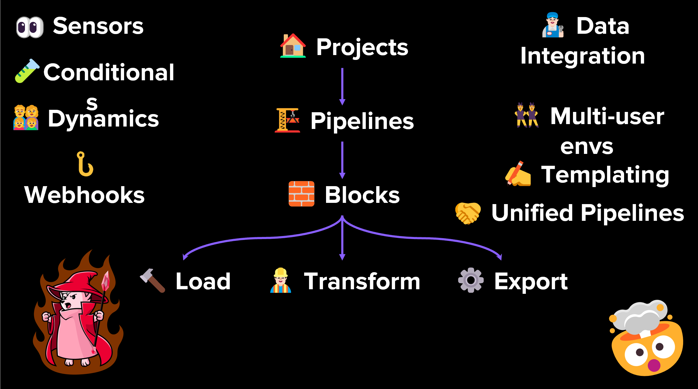

 

  

<h1 align = "center">
<b><i>Mage</i></b>
</h1>

  

  

 

Mage is a Workflow Orchestration tool that allows you to build, run, and manage data pipelines for integrating and
transforming data.
It allows you to create real-time and batch pipelines to transform data using several programming languages, such as
Python, SQL and R.

# Core Abstractions

- 🏢  **Project**: Like a repository on GitHub; this is where you write all your code.
- 🪈  **Pipeline**: Contains references to all the blocks of code you want to run, charts for visualizing data, and
  organizes the dependency between each block of code.
- 🧱  **Block**: A file with code that can be executed independently or within a pipeline.
- 🤓  **Data Product**:  Every block produces data after it’s been executed. These are called data products in Mage.
- ⏰  **Trigger**:  A set of instructions that determine when or how a pipeline should run.
- 🏃‍♂️  **Run Stores**: information about when it was started, its status, when it was completed, any runtime variables
  used in the execution of the pipeline or block, etc.
