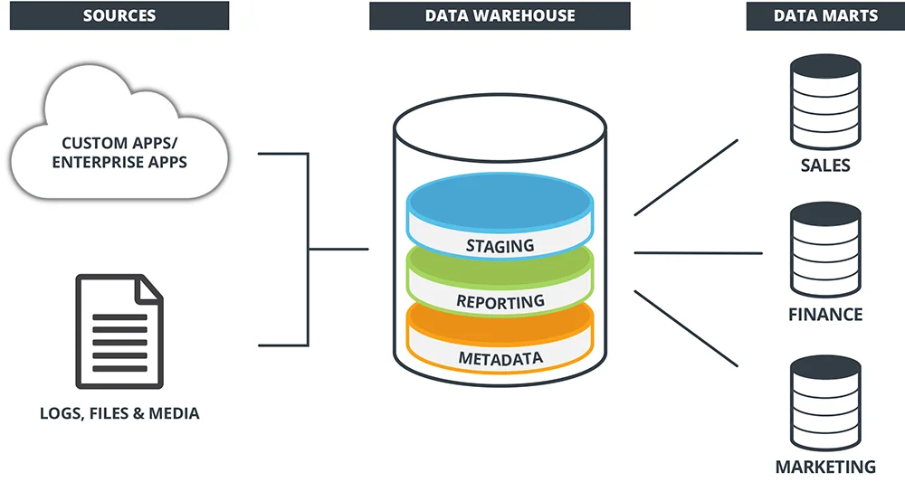

 

  

<h1 align = "center">
<b><i>Data Warehousing</i></b>
</h1>

  

  

 

Data warehousing is a crucial component in modern business intelligence and data engineering. It consists of an
enterprise system used for the analysis and reporting of structured and semi-structured data from multiple sources.

### Goals

1. **Consolidation:**

- Centralizes data from different sources into a single repository.
- Enables a unified view of the organization's data.

2. **Analysis:**

- Facilitates complex analysis and reporting for informed decision-making.
- Supports data-driven insights and strategic planning.

## Components

* **Data Sources**: Origins of data, such as flat files, external systems or operational databases.
* **Staging Area**: An interim storage area where data is landed and undergoes the ETL process.
* **Data Warehouse**: The core component that stores integrated and processed data for analytical purposes.
* **Data Marts**: Subsets of a data warehouse that are focused on specific business functions or user groups.
* **Users**: Individuals or groups who interact with the data warehouse for analysis, reporting, and decision-making.
  

## OLAP vs OLTP

|                         | OLTP                                                                                              | OLAP                                                                              |
|-------------------------|---------------------------------------------------------------------------------------------------|-----------------------------------------------------------------------------------|
| **Definition**          | Online Transaction Processing                                                                     | Online Analytical Processing                                                      |
| **Purpose**             | Control and run essential business operations in real time                                        | Plan, solve problems, support decisions, discover hidden insights                 |
| **Data updates**        | Short, fast updates initiated by the user                                                         | Data periodically refreshed with scheduled, long-running batch jobs               |
| **Database design**     | Normalized databases for efficiency                                                               | Denormalized databases for analysis                                               |
| **Space requirements**  | Generally small if historical data is archived                                                    | Generally large due to aggregating large datasets                                 |
| **Backup and recovery** | Regular backups required to ensure business continuity and meet legal and governance requirements | Lost data can be reloaded from OLTP database as needed in lieu of regular backups |
| **Productivity**        | Increases productivity of end users                                                               | Increases productivity of business managers, data analysts, and executives        |
| **Data view**           | Lists day-to-day business transactions                                                            | Multi-dimensional view of enterprise data                                         |
| **User examples**       | Customer-facing personnel, clerks, online shoppers                                                | Knowledge workers such as data analysts, business analysts, and executives        |

In summary, OLTP emphasizes real-time transaction processing for operational efficiency, while OLAP focuses on
analytical processing for strategic decision-making and insights discovery.
