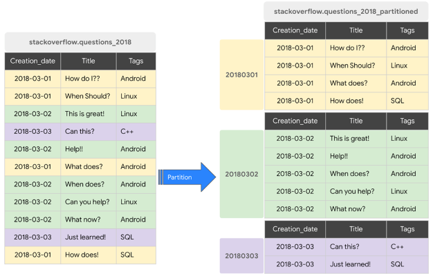
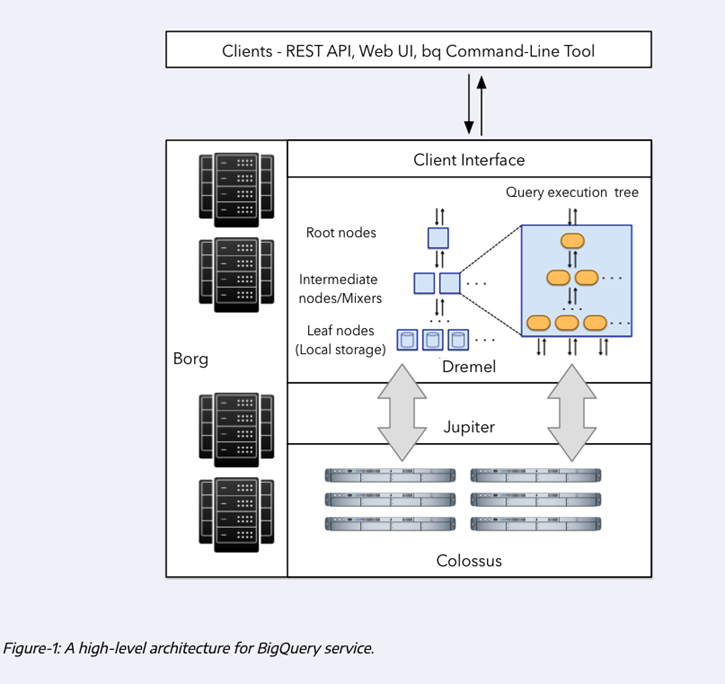

 

  

<h1 align = "center">
<b><i>Google BigQuery</i></b>
</h1>

  

  

 

Google BigQuery is Google's serverless data warehouse that enables scalable analysis over petabytes of data.
It consists of a platform as a service which supports querying using a SQL-dialect and has several built-in
machine learning capabilities.

## Advantages

- Serverless. No software installation required.
- Scalability
- High-availability
- Built-in features (machine learning, geospatial analysis, business intelligence)
- Flexibility: separates the compute engine from the storage

## Cost

* On Demand Pricing
  * 1 TB of data processed is 5$
* Flat rate Pricing
  * Based on number of pre-requested slots
  * 100 slots -> 2000$ monthly = 400TB data processed on demand pricing

## Partitioning

Partitioning in BigQuery involves organizing data into smaller, manageable subsets based on a specific column or
expression. This helps improve query performance and reduce costs by enabling efficient data retrieval.

We can partition by:

- Time-unit column
- Ingestion time (`_PARTITIONTIME`)
- Integer range
- When using Time unit or ingestion time
  - Daily (Default)
  - Hourly
  - Monthly or yearly

Number of partitions limit is 4000.

## Clustering

Clustering is another optimization technique in BigQuery that complements partitioning. In BigQuery, clustering helps in
automatically organizing the data based on the clustered column/columns. Clustering is usually performed on columns with
high cardinality and can be done on a partitioned table as well, to get the maximum performance increase of your
queries.

- Columns you specify are used to colocate related data
- Order of the column is important
- The order of the specified columns determines the sort order of the data.
- Clustering improves
  - Filter queries
  - Aggregate queries
- Table with data size < 1 GB, don’t show significant improvement with partitioning and clustering
- You can specify up to four clustering columns

## Partitioning v Clustering

| Clustering                                                              | Partitioning                         |
|-------------------------------------------------------------------------|--------------------------------------|
| Cost benefit unknown                                                    | Cost known upfront                   |
| You need more granularity than partitioning alone allows                | You need partition-level management  |
| Queries commonly use filters or aggregations against particular columns | Filter or aggregate on single column |
| The cardinality of the number of values in a column is large            | ------------------------------------ |

## Best Practices

### Cost Reduction

* Avoid `SELECT *`, specify columns as needed
* Price your queries before running them
* Use clustered or partitioned tables
* Use streaming inserts with caution
* Materialize query results in stages

### Query Performance

* Filter on partitioned columns
* Denormalize data
* Reduce data before using `JOIN` clauses
* Do not treat `WITH` clauses as prepared statements

## BigQuery Internals

Let’s explore the below illustration of the overall architecture of BigQuery point by point.
First, let's note that storage and compute are separated, which is the cause of BigQuery's outstanding
performance for large-scale data analysis.

- **Dremel**: Query execution engine, which breaks each query into a tree structure, which is executed in parallel
  across various nodes.
- **Colossus**: Google's distributed file storage that stores data in a columnar format, where BigQuery natively stores
  customer data in Google Cloud Platform.
- **Jupiter** A fast network for communication, implemented inside Google's data center and has ~1TB bandwidth.

