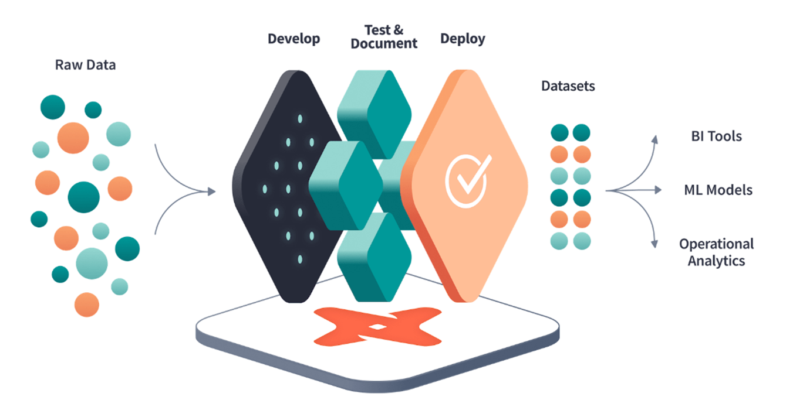
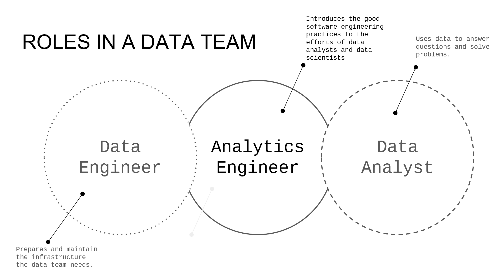
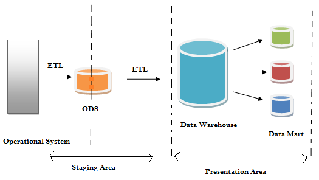
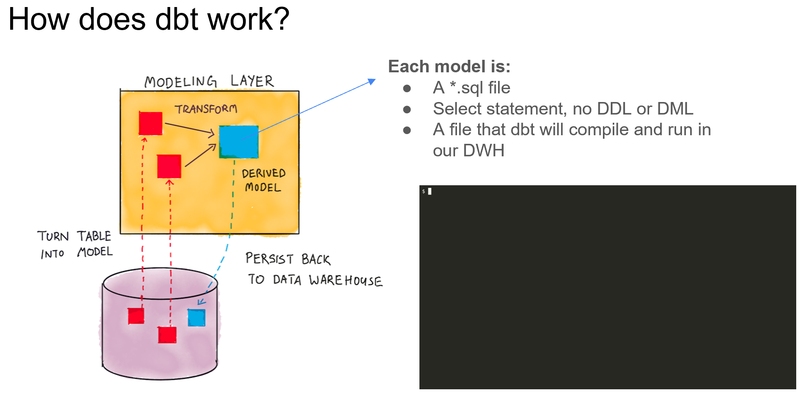

 

  

<h1 align = "center">
<b><i>Analytics Engineering</i></b>
</h1>

  

  

 

## Roles in a Data Team

- Data Engineer: preparing and maintaining infrastructure that hosts data
- Data Analysts: uses the data to answer the questions and solve business problems
- Analytics Engineer: introduces good software engineering practices to the efforts of data analysts and data scientists

## Data Modelling Concepts

- ETL: Longer to implement, as data is transformed before it is loaded with higher storage and compute costs.
- ELT: Faster and more flexible with lower cost and maintenance.

## Kimball's Dimensional Modelling

Dimensional modeling is a technique introduced by Ralph Kimball in 1996 with his book, The Data Warehouse Toolkit. The
goal of dimensional modeling is to take raw data and transform it into Fact and Dimension tables that represent the
business.

### Objective

- Deliver data understandable to the business user
- Deliver fast query performance

### Approach

Prioritize user understandability and query performance over non-redundant data (3NF - 3rd Normal Form)

### Elements

- **Fact Tables**: Corresponds to a business process (measurements, metrics or facts). "Verbs".
- **Dimension Tables**: Corresponds to a business entity. "Nouns".

### Architecture

- **Staging Area**: Contains the raw data, not meant to be exposed to everyone.
- **Processing Area**: From raw data to data models. Focuses in efficiency and ensures standards are met.
- **Presentation Area**: Final presentation of the data. Exposure to the business stakeholders.

 

  

<h1 align = "center">
<b><i>Introduction to dbt</i></b>
</h1>

  

  

 

`dbt` is a transformation workflow that allows anyone that knows SQL to deploy
analytics code following good software engineering practices such as modularity,
portability, CI/CD and documentation.

## How does it work?

Each model is a sql select statement (no DDL or DML) which will compile and run
in our data warehouse. Whenever we do a `dbt run` all that code is compiled and run against our
data warehouse, to be finally persisted back to it.

## How to use dbt?

There are two options to run dbt, either with `dbt` Core or `dbt` Cloud. The differences between both of them
are shown in the table below:

| Feature            | dbt Core                                         | dbt Cloud                       |
|--------------------|--------------------------------------------------|---------------------------------|
| Type               | Open-source project                              | SaaS application                |
| Description        | Data transformation tool                         | Develop and manage dbt projects |
| IDE                | CLI interface                                    | Web-based IDE, Cloud CLI        |
| Environment        | Local                                            | Managed environments            |
| Job Orchestration  | N/A                                              | Jobs orchestration              |
| Logging/Alerting   | N/A                                              | Logging and Alerting            |
| Documentation      | SQL compilation logic, macros, database adapters | Integrated documentation        |
| Admin/Metadata API | N/A                                              | Admin and metadata API          |
| Semantic Layer     | N/A                                              | Semantic Layer                  |
| Cost               | Open source and free to use                      | SaaS subscription-based         |

