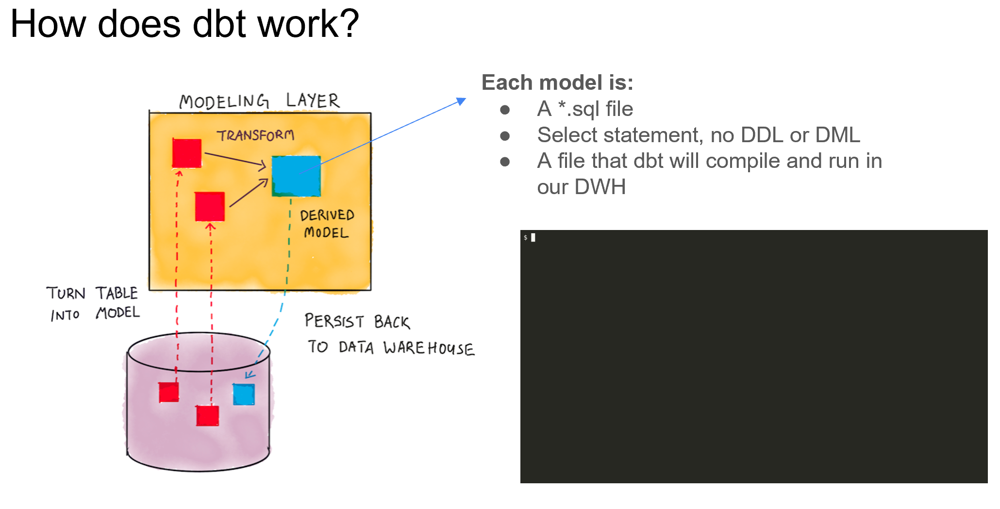

 

  

<h1 align = "center">
<b><i>Introduction to dbt</i></b>
</h1>

  

  

 

`dbt` is a transformation workflow that allows anyone that knows SQL to deploy
analytics code following good software engineering practices such as modularity,
portability, CI/CD and documentation.

## How does it work?

Each model is a sql select statement (no DDL or DML) which will compile and run
in our data warehouse. Whenever we do a `dbt run` all that code is compiled and run against our
data warehouse, to be finally persisted back to it.

## How to use dbt?

There are two options to run dbt, either with `dbt` Core or `dbt` Cloud. The differences between both of them
are shown in the table below:

| Feature            | dbt Core                                         | dbt Cloud                       |
|--------------------|--------------------------------------------------|---------------------------------|
| Type               | Open-source project                              | SaaS application                |
| Description        | Data transformation tool                         | Develop and manage dbt projects |
| IDE                | CLI interface                                    | Web-based IDE, Cloud CLI        |
| Environment        | Local                                            | Managed environments            |
| Job Orchestration  | N/A                                              | Jobs orchestration              |
| Logging/Alerting   | N/A                                              | Logging and Alerting            |
| Documentation      | SQL compilation logic, macros, database adapters | Integrated documentation        |
| Admin/Metadata API | N/A                                              | Admin and metadata API          |
| Semantic Layer     | N/A                                              | Semantic Layer                  |
| Cost               | Open source and free to use                      | SaaS subscription-based         |

