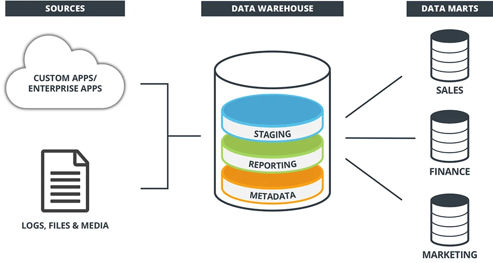

 

  

<h1 align = "center">
<b><i>Data Warehousing</i></b>
</h1>

  

  

 

# Data Warehousing

## Introduction

Data warehousing is a comprehensive approach to managing and storing data from various sources within an organization to support business intelligence and reporting activities. It involves the integration, transformation, and storage of data to provide a centralized repository for efficient analysis and decision-making.

## Key Components

### 1. Data Warehouse

A **data warehouse** is the core component of the data warehousing architecture. It is a large, centralized repository that stores historical and current data from different sources. The data warehouse is designed for query and analysis, and it often employs technologies such as online analytical processing (OLAP) to facilitate complex reporting and data exploration.

### 2. ETL (Extract, Transform, Load) Process

The **ETL process** is a crucial step in data warehousing. It involves extracting data from source systems, transforming it into a suitable format for analysis, and loading it into the data warehouse. ETL tools help automate these processes and ensure the consistency and accuracy of the data in the warehouse.

### 3. Data Marts

**Data marts** are smaller, more focused subsets of a data warehouse that are designed for the needs of specific business departments or user groups. They contain a subset of the data warehouse's data and are optimized for a particular type of analysis.

### 4. Dimensional Modeling

As mentioned earlier, **dimensional modeling** is a design technique commonly used in data warehousing. It involves organizing data into fact tables and dimension tables, creating a structure that is optimized for analytical queries and reporting.

## Goals and Benefits

### 1. Decision Support and Business Intelligence

The primary goal of data warehousing is to provide a solid foundation for decision support and business intelligence. By consolidating data from various sources into a single, accessible repository, organizations can gain insights, identify trends, and make informed decisions.

### 2. Historical Analysis

Data warehousing supports historical analysis by storing historical data, allowing users to analyze trends and changes over time. This is particularly valuable for understanding the evolution of business metrics.

### 3. Improved Data Quality

Through the ETL process and data cleansing activities, data warehousing helps improve the quality and consistency of data. This ensures that the information used for analysis and reporting is accurate and reliable.

## Challenges

While data warehousing offers numerous benefits, it also comes with challenges, including:

- **Complexity:** Building and maintaining a data warehouse can be complex and resource-intensive.

- **Integration Issues:** Integrating data from diverse sources with different formats can be challenging.

- **Scalability:** As data volumes grow, ensuring the scalability of the data warehouse becomes crucial.

## Conclusion

Data warehousing is a fundamental component of modern business intelligence, providing organizations with the tools and infrastructure needed to turn raw data into actionable insights. By centralizing and organizing data for analysis, data warehousing empowers businesses to make informed decisions and gain a competitive edge.

For more in-depth information, refer to industry-standard books and resources on data warehousing.
